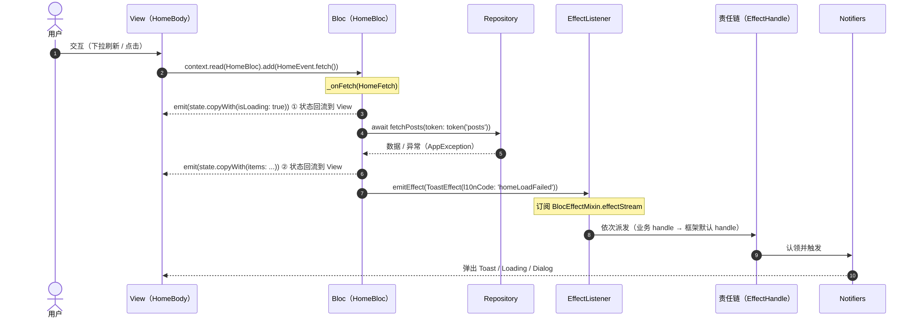

# 架构总览与分层

本文档描述 **`fluzer create` 生成后的项目**的目录结构，以及 MVI 在该项目中如何设计与内部工作。所有描述均基于当前代码。

> 网络请求封装（`DioClient`、拦截器）属于数据层细节，本文不展开；业务侧只需关心 `Repository` 暴露的方法，以及出错时抛出的 `AppException`（详见 [错误处理与 Result](error-handling.md)）。

---

## 1. 三仓库关系

| 仓库 | 角色 | 说明 |
|------|------|------|
| `flutter_zero_app` | 示例应用 | 模板落地后的真实项目样例，含 `home` / `counter` / `search` / `login` / `settings` 模块演示 |
| `flutter_zero_cli` | 脚手架 `fluzer` | 从模板源渲染出项目与功能模块骨架 |
| `flutter_zero_template` | 模板源（Mason Brick） | `fluzer` 读取它来生成代码；`create` 用 `project` brick，`new` 用 `feature` brick |

---

## 2. `fluzer create` 生成的项目目录结构

`create` 渲染 `project` brick 后执行 `flutter create` / `pub get` / `gen-l10n` / `build_runner`，得到如下 `lib/`：

```
lib/
├── app.dart                     # 应用根组件（配置 MaterialApp.router + NotifiersHost）
├── main.dart                    # 入口
├── l10n/                        # 国际化 arb 源文件
│   ├── app_en.arb
│   └── app_zh.arb
├── router/
│   └── app_router.dart          # go_router 路由表
├── features/                    # 业务功能层（初始为空，由 fluzer new 填充）
└── core/                        # 跨功能的核心基础设施
    ├── auth/                    # TokenStorage（双缓存：内存 + 安全存储）
    ├── bloc/                    # BLoC 四个 Mixin（见 bloc-mixins.md）
    ├── constants/               # API / 应用常量
    ├── data/                    # 共享数据层（跨模块共享的模型与仓库）
    │   ├── models/              # 共享数据模型（DTO，被 2+ feature 复用时上移至此）
    │   ├── repositories/        # 共享仓库（继承 BaseRepository）
    │   └── shares_repositories.dart  # 共享仓库 DI 注册中心
    ├── storage/                 # 存储与仓库基类（BaseRepository 在此）
    ├── di/                      # 依赖注入（get_it 三文件，见 dependency-injection.md）
    ├── effect/                  # Effect 系统（见 effect-system.md）
    ├── error/                   # AppException / ErrorHandler / AppErrorCodes
    ├── result/                  # Result<T>（Success / Failure / Cancel）
    ├── localization/            # gen-l10n 封装（context.l 扩展）
    ├── network/                 # DioClient / 拦截器（本文不展开）
    ├── notifiers/               # Notifiers 系统（见 effect-system.md）
    ├── theme/                   # AppTheme / ThemeProvider
    └── utils/                   # log 等工具
```

**约定（分层边界）**：

- **feature 之间不直接横向 import 对方的 `presentation/`**（页面、BLoC、状态、effect handle）。一个功能模块不应知道另一个功能模块的 View/ViewModel 细节，否则会形成网状耦合、难以单独演进。
- **数据层不依赖 `presentation/`**；`presentation/` 不反向依赖 `data/` 的 DTO（见下「状态纯度」）。
- 若多个 feature 需要访问同一份数据（例如设置页用到当前登录用户），**不要**让 settings 直接 `import` user 模块的源码 — 这会破坏分层。正确做法见下「跨模块数据共享」。

> 澄清：「模块之间不得互相 import」指的是**页面/状态/BLoC 这一层不横向互引**，并不禁止共享数据访问能力。共享能力应上提到 `core/` 成为公共基础设施，各 feature 统一从 `core` 依赖。

### 跨模块数据共享

当一份数据被多个 feature 共同需要（典型如「用户会话 / 登录态」被 settings、profile、home 等多个页面读取），遵循以下优先级：

1. **提取到 `core/data/repositories/` 作为公共 Repository（首选）**：把 `UserRepository`、`AuthRepository` 这类跨模块共享的仓储放到 `core/data/repositories/`，DI 注册写在 `core/data/shares_repositories.dart` 的 `register` 中（登记为 `lazySingleton`）。`SharesRepositories.register(getIt)` 在 `injection_base.dart` 的 `registerFeatureModules` 中调用，与 feature 模块注册一起在启动时生效。需要它的 feature 从 `core` 导入并 `getIt<UserRepository>()` 取用，**而不是 import 另一个 feature 的目录**。
2. **经路由参数 / 构造入参传递**：若数据量小且来自上游页面（如列表点进详情的 id），通过 `go_router` 路由参数或构造入参传入，避免为这点数据引入跨模块依赖。
3. **经共享 `core` service 通信**：跨模块行为（如「退出登录后跳登录页」）通过 `core` 中的事件 / 通知服务广播，监听方在自身模块内响应，而非互相 import。

一句话：**feature 之间靠 `core` 和 DI 解耦，而非靠彼此 import。** repository 该共享就共享，只是它的"家"应该在 `core`，而不是某个具体 feature 里。

---

## 3. 功能模块结构（`fluzer new <name>` 生成）

`new` 渲染 `feature` brick，并在 `injection_base.dart` 的 `registerFeatureModules` 区域自动注入 DI 注册。

```
lib/features/<name>/
├── <name>_module.dart          # 模块依赖注册（只注册 Repository，BLoC 不进 DI）
├── data/
│   ├── data_sources/            # 数据源（可选，封装 Dio/本地存储等外部读写）
│   ├── models/<name>_model.dart # 数据模型（freezed）
│   └── repositories/<name>_repository.dart  # 仓库（继承 BaseRepository）
└── presentation/
    ├── bloc/                    # MVI 三件套
    │   ├── <name>_bloc.dart
    │   ├── <name>_event.dart
    │   └── <name>_state.dart
    ├── effects/<name>_effect_handle.dart   # 业务副作用处理器
    ├── pages/                   # View
    │   ├── <name>_page.dart     # 包裹 BlocProvider + EffectListener
    │   └── <name>_body.dart     # 纯渲染内容
    └── widgets/                 # 模块内复用组件（可选）
```

骨架生成后，`<name>_event.dart` / `<name>_state.dart` 是 freezed 空壳（含注释指引），`<name>_bloc.dart` 已混入四个 Mixin 并留好 `_onXxx` 注释位；开发者按业务补充即可。

---

## 4. MVI 在项目中如何落地

本项目采用 **MVI-as-BLoC** 变体，与国际公认的 MVI 范式一致：

| MVI 角色 | 本项目实现 | 文件 |
|----------|------------|------|
| **Intent**（用户意图） | `XxxEvent`（freezed 密封联合） | `*_event.dart` |
| **ViewModel** | `XxxBloc`（`extends Bloc` + 四个 Mixin） | `*_bloc.dart` |
| **Model / ViewState** | `XxxState`（freezed 不可变单对象） | `*_state.dart` |
| **View** | `XxxPage` + `XxxBody`（只渲染 State、发射 Intent） | `pages/` |
| **一次性副作用通道** | `Effect`（独立 Stream，不进 State） | `core/effect/` |

以 `home` 模块为例（`lib/features/home/`）：

```dart
// Intent：freezed 密封联合
@freezed
abstract class HomeEvent with _$HomeEvent {
  const factory HomeEvent.fetch() = HomeFetch;
  const factory HomeEvent.loadMore() = HomeLoadMore;
  const factory HomeEvent.refresh() = HomeRefresh;
}

// ViewState：单一不可变对象
@freezed
abstract class HomeState with _$HomeState {
  const factory HomeState({
    @Default(PaginationState<PostModel>()) PaginationState<PostModel> pagination,
  }) = _HomeState;
}

// ViewModel：单向流转（四个 Mixin 协同）
class HomeBloc extends Bloc<HomeEvent, HomeState>
    with
        BlocAwaitMixin,
        BlocEffectMixin,
        BlocCancelTokenMixin,
        BlocErrorHandlerMixin {
  HomeBloc({required this.repository}) : super(const HomeState()) {
    on<HomeFetch>(_onFetch);
    onAwait<HomeRefresh>(_awaitKeyRefresh, _onRefresh);
    // ...
  }
}
```

**View 是 State 的纯函数**：`HomeBody` 通过 `context.watch<HomeBloc>()` 取得 `HomeState` 后只负责渲染，并通过 `context.read<HomeBloc>().add(...)` 发射 Intent，绝不自己改状态。

---

## 5. 内部工作机制：单向数据流



关键点：

1. **状态是唯一渲染来源**：`BlocBuilder` / `context.watch` 只在 `HomeState` 变化时重建 View。
2. **Effect 不污染 State**：`emitEffect(...)` 走 `BlocEffectMixin.effectStream`（独立 broadcast Stream），由 `EffectListener` 订阅，不会写入 `HomeState`，因此不存在「单槽覆盖 / 重复投递」。
3. **错误归一化**：请求失败时 `_onFetch` 通过 `runToResult` 得到 `Failure(ex)`，再 `emitEffect(ex.toToastEffect())`——异常被统一成 `AppException`，错误 UI 可走状态、提示走副作用（详见 [错误处理与 Result](error-handling.md)）。

---

## 6. 四个 BLoC Mixin 的职责

`core/bloc/` 提供四个可组合的 Mixin，详见 [BLoC 四个 Mixin](bloc-mixins.md)。

| Mixin | 解决的问题 | 典型用法 |
|-------|-----------|----------|
| `BlocAwaitMixin` | `add(Event)` 是 fire-and-forget，UI 无法直接 `await`（如 `RefreshIndicator.onRefresh`） | `Future<void> refresh() => runAwait(event: const XxxEvent.refresh(), key: 'refresh');`，或用 `onAwait` 自动收尾 |
| `BlocCancelTokenMixin` | 按 key 管理 Dio `CancelToken`，页面销毁自动取消、连续调用去重 | `repository.fetchPosts(cancelToken: token('posts'))`；`on DioException cancel => return` 静默 |
| `BlocEffectMixin` | 提供一次性副作用通道 | `emitEffect(const ToastEffect(l10nCode: 'homeLoadFailed'))` |
| `BlocErrorHandlerMixin` | 统一把底层异常归一化为 `AppException`，并用 `Result<T>` 表达成功/失败/取消 | `final r = await runToResult(() => repository.fetch()); r.when(success: ..., failure: ..., cancel: ...)` |

`home` 模块同时用到四者：`refresh()` / `loadMore()` 经 `BlocAwaitMixin` 可等待；列表请求经 `BlocCancelTokenMixin` 的 `token('posts')` 取消；`_onFetch` 经 `BlocErrorHandlerMixin` 的 `runToResult` 处理错误；副作用经 `BlocEffectMixin` 发出。

---

## 7. 依赖注入约定

DI 由三个文件协作（`core/di/`，详见 [依赖注入](dependency-injection.md)）：

- `get_it_instance.dart` —— 全局 `getIt` 实例。
- `injection_base.dart` —— 含 `registerAll` 与 `registerFeatureModules`；`fluzer new` 会在此注入新模块的 `register()` 调用，共享仓库的注册入口 `SharesRepositories.register(getIt)` 也在此调用。
- `injection.dart` —— 用户手写区（注册基础设施实现 / 第三方 SDK）。
- `core/data/shares_repositories.dart` —— 跨模块共享仓库的 DI 注册中心（`SharesRepositories.register`）；在此登记各个共享仓库为 `lazySingleton`，由 `injection_base.dart` 的 `registerFeatureModules` 调用生效。

**重要约定**：`DioClient`、`Repository`、`Service` 注册为 `lazySingleton`；**BLoC 不注册进 DI**，而是由 `BlocProvider` 在页面创建（避免长期持有导致泄漏）。这与 `home_page.dart` / 生成的 `<name>_page.dart` 中 `BlocProvider(create: (_) => XxxBloc(repository: getIt<XxxRepository>()))` 一致。

---

## 8. 状态纯度（已知取舍）

当前 `HomeState` 直接持有数据层 DTO `PostModel`（`home_state.dart` import `data/models/post_model.dart`）。严格分层要求 State 持有 **presentation 层 UiModel**（`PostModel` → `PostUiModel` 在 Bloc 内映射），让 `presentation/` 不向下依赖 `data/`。

本项目作为 BLoC-MVI 模板接受这一主流取舍；若你追求最严格的分层，可在 Bloc 内做一层 `PostModel → PostUiModel` 映射再进 State。这不影响 MVI 的合规性。
