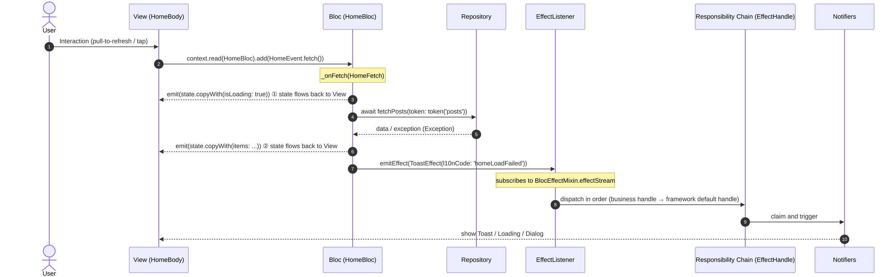

# Architecture Overview & Layering

This document describes the directory structure of the project generated by **`fluzer create`**, and how MVI is designed and works internally. Everything described is based on the current code.

> The network-request wrapper (`Dio`, interceptors) is a data-layer detail and is not covered here; on the business side you only care about the methods `Repository` exposes, and the `Exception` thrown on error (see [Error Handling & Result](error-handling.md)).

---

## 1. The Three-Repository Relationship

| Repository | Role | Description |
|------------|------|-------------|
| `flutter_zero_app` | Example app | A real project sample after the template lands, demonstrating the `home` / `counter` / `search` / `login` / `settings` modules |
| `flutter_zero_cli` | Scaffolding `fluzer` | Renders project and feature-module skeletons from the template source |
| `flutter_zero_template` | Template source (Mason Brick) | What `fluzer` reads to generate code; `create` uses the `project` brick, `new` uses the `feature` brick |

---

## 2. Project Structure Generated by `fluzer create`

After `create` renders the `project` brick it runs `flutter create` / `pub get` / `gen-l10n`, yielding this `lib/`:

```
lib/
├── app.dart                     # App root widget (configures MaterialApp.router + NotifiersHost)
├── main.dart                    # Entry point
├── l10n/                        # i18n arb source files
│   ├── app_en.arb
│   └── app_zh.arb
├── router/
│   └── app_router.dart          # go_router route table
├── features/                    # Business feature layer (initially empty, filled by fluzer new)
└── core/                        # Cross-feature core infrastructure
    ├── auth/                    # TokenStorage (dual cache: memory + secure storage)
    ├── bloc/                    # The four BLoC Mixins (see bloc-mixins.md)
    ├── constants/               # API / app constants
    ├── data/                    # Shared data layer (models & repositories shared across modules)
    │   ├── models/              # Shared data models (DTOs, promoted here when reused by 2+ features)
    │   ├── repositories/        # Shared repositories (extend BaseRepository)
    │   └── shares_repositories.dart  # Shared-repository DI registration center
    ├── network/                 # Network and repository base class (BaseRepository lives here) + Dio / interceptors (not covered here)
    ├── di/                      # Dependency injection (get_it three files, see dependency-injection.md)
    ├── effect/                  # Effect system (see effect-system.md)
    ├── result/                  # Result<T> (Success / Failure / Cancel)
    ├── localization/            # gen-l10n wrapper (context.l extension)
    ├── notifiers/               # Notifiers system (see effect-system.md)
    ├── theme/                   # AppTheme / ThemeProvider
    └── utils/                   # logging and other utilities
```

**Conventions (layer boundaries)**:

- **Features must not directly `import` each other's `presentation/`** (pages, BLoCs, states, effect handles). A feature module should not know another feature module's View/ViewModel details, otherwise it forms a mesh coupling that is hard to evolve independently.
- **The data layer does not depend on `presentation/`**; `presentation/` does not reverse-depend on the data layer's DTOs (see "State purity" below).
- If multiple features need access to the same data (e.g. the settings page uses the current logged-in user), **do not** let settings directly `import` the user module's source — that breaks layering. The correct approach is "Cross-module data sharing" below.

> Clarification: "modules must not import each other" means the **page/state/BLoC layer must not cross-import**; it does NOT forbid sharing data-access capabilities. Shared capabilities should be promoted to `core/` as common infrastructure, and each feature depends on `core` uniformly.

### Cross-module data sharing

When a piece of data is needed by multiple features (typically "user session / login state" read by settings, profile, home, etc.), follow this priority:

1. **Extract to `core/data/repositories/` as a shared Repository (preferred)**: put cross-module shared repositories like `UserRepository` / `AuthRepository` in `core/data/repositories/`, register them in `core/data/shares_repositories.dart`'s `register` (as `lazySingleton`). `SharesRepositories.register(getIt)` is called inside `injection_base.dart`'s `registerFeatureModules`, taking effect at startup alongside feature-module registration. Features that need it import from `core` and fetch via `getIt<UserRepository>()`, **instead of importing another feature's directory**.
2. **Pass via route params / constructor args**: if the data is small and comes from an upstream page (e.g. the id when drilling into detail from a list), pass it via `go_router` route params or constructor args, avoiding a cross-module dependency for just that bit of data.
3. **Communicate via a shared `core` service**: cross-module behavior (e.g. "jump to login after logout") is broadcast through an event / notification service in `core`; the listener responds within its own module, rather than importing each other.

In one sentence: **features are decoupled via `core` and DI, not by importing each other.** Repositories that should be shared are shared — only their "home" should be in `core`, not inside a specific feature.

---

## 3. Feature Module Structure (generated by `fluzer new <name>`)

`new` renders the `feature` brick and automatically injects the DI registration into the `registerFeatureModules` region of `injection_base.dart`.

```
lib/features/<name>/
├── <name>_module.dart          # Module dependency registration (only registers the Repository; BLoC is not in DI)
├── data/
│   ├── data_sources/            # Data sources (optional; wrap Dio/local storage, etc.)
│   ├── models/<name>_model.dart # Data model (freezed)
│   └── repositories/<name>_repository.dart  # Repository (extends BaseRepository)
└── presentation/
    ├── bloc/                    # MVI trio
    │   ├── <name>_bloc.dart
    │   ├── <name>_event.dart
    │   └── <name>_state.dart
    ├── effects/<name>_effect_handle.dart   # Business side-effect handler
    ├── pages/                   # View
    │   ├── <name>_page.dart     # Wraps BlocProvider + EffectListener
    │   └── <name>_body.dart     # Pure render content
    └── widgets/                 # In-module reusable widgets (optional)
```

After the skeleton is generated, `<name>_event.dart` / `<name>_state.dart` are freezed empty shells (with guiding comments), and `<name>_bloc.dart` already mixes in the four Mixins with `_onXxx` comment placeholders; the developer fills them in per business need.

---

## 4. How MVI Lands in the Project

This project uses an **MVI-as-BLoC** variant, consistent with the internationally recognized MVI paradigm:

| MVI role | Implementation in this project | File |
|----------|--------------------------------|------|
| **Intent** (user intent) | `XxxEvent` (freezed sealed union) | `*_event.dart` |
| **ViewModel** | `XxxBloc` (`extends Bloc` + four Mixins) | `*_bloc.dart` |
| **Model / ViewState** | `XxxState` (single freezed immutable object) | `*_state.dart` |
| **View** | `XxxPage` + `XxxBody` (only renders State, emits Intent) | `pages/` |
| **One-shot side-effect channel** | `Effect` (independent Stream, not in State) | `core/effect/` |

Using the `home` module as an example (`lib/features/home/`):

```dart
// Intent: freezed sealed union
@freezed
abstract class HomeEvent with _$HomeEvent {
  const factory HomeEvent.fetch() = HomeFetch;
  const factory HomeEvent.loadMore() = HomeLoadMore;
  const factory HomeEvent.refresh() = HomeRefresh;
}

// ViewState: single immutable object
@freezed
abstract class HomeState with _$HomeState {
  const factory HomeState({
    @Default(PaginationState<PostModel>()) PaginationState<PostModel> pagination,
  }) = _HomeState;
}

// ViewModel: unidirectional flow (four Mixins working together)
class HomeBloc extends Bloc<HomeEvent, HomeState>
    with
        BlocAwaitMixin,
        BlocEffectMixin,
        BlocCancelTokenMixin,
        BlocErrorHandlerMixin {
  HomeBloc({required this.repository}) : super(const HomeState()) {
    on<HomeFetch>(_onFetch);
    onAwait<HomeRefresh>(_awaitKeyRefresh, _onRefresh);
    // ...
  }
}
```

**The View is a pure function of State**: `HomeBody` obtains `HomeState` via `context.watch<HomeBloc>()` and only renders; it emits Intent via `context.read<HomeBloc>().add(...)`, and never mutates state itself.

---

## 5. Internal Mechanism: Unidirectional Data Flow



Key points:

1. **State is the single source of rendering**: `BlocBuilder` / `context.watch` only rebuilds the View when `HomeState` changes.
2. **Effect does not pollute State**: `emitEffect(...)` travels through `BlocEffectMixin.effectStream` (an independent broadcast Stream), subscribed by `EffectListener`; it is never written into `HomeState`, so there is no "single-slot overwrite / duplicate delivery".
3. **Error handling**: on request failure `_onFetch` gets `Failure(ex)` (where `ex` is the raw `Exception`) via `runCatching`, then `emitEffect(ex.toToastEffect())` — exceptions pass through unchanged, with no normalization; the error UI can go through state, and the prompt through side-effects (see [Error Handling & Result](error-handling.md)).

---

## 6. Responsibilities of the Four BLoC Mixins

`core/bloc/` provides four composable Mixins; see [The Four BLoC Mixins](bloc-mixins.md).

| Mixin | Problem solved | Typical usage |
|-------|----------------|---------------|
| `BlocAwaitMixin` | `add(Event)` is fire-and-forget; the UI cannot `await` (e.g. `RefreshIndicator.onRefresh`) | `Future<void> refresh() => runAwait(event: const XxxEvent.refresh(), key: 'refresh');`, or use `onAwait` for auto-finalization |
| `BlocCancelTokenMixin` | Manage Dio `CancelToken` by key; auto-cancel on page dispose, dedupe on consecutive calls | `repository.fetchPosts(cancelToken: token('posts'))`; `on DioException cancel => return` silently |
| `BlocEffectMixin` | Provides the one-shot side-effect channel | `emitEffect(const ToastEffect(l10nCode: 'homeLoadFailed'))` |
| `BlocErrorHandlerMixin` | Wraps exceptions into `Result<T>` (success/failure/cancel); `Failure` carries the raw `Exception` | `final r = await runCatching(() => repository.fetch()); r.when(success: ..., failure: ..., cancel: ...)` |

`home` uses all four at once: `refresh()` / `loadMore()` are awaitable via `BlocAwaitMixin`; list requests are cancelled via `BlocCancelTokenMixin`'s `token('posts')`; `_onFetch` handles errors via `BlocErrorHandlerMixin`'s `runCatching`; side-effects are emitted via `BlocEffectMixin`.

---

## 7. Dependency Injection Conventions

DI is coordinated by three files (`core/di/`, see [Dependency Injection](dependency-injection.md)):

- `get_it_instance.dart` — the global `getIt` instance.
- `injection_base.dart` — contains `registerAll` and `registerFeatureModules`; `fluzer new` injects the new module's `register()` call here, and the shared-repository entry `SharesRepositories.register(getIt)` is also called here.
- `injection.dart` — your hand-written region (register infrastructure implementations / third-party SDKs).
- `core/data/shares_repositories.dart` — DI registration center for cross-module shared repositories (`SharesRepositories.register`); register each shared repository here as a `lazySingleton`, invoked by `injection_base.dart`'s `registerFeatureModules`.

**Important convention**: `Repository`, `Service` are registered as `lazySingleton`; `Dio` is registered once by the framework's infrastructure; **BLoCs are not registered in DI**, but created by `BlocProvider` on the page (to avoid leaks from long-lived holding). This is consistent with `home_page.dart` / the generated `<name>_page.dart` doing `BlocProvider(create: (_) => XxxBloc(repository: getIt<XxxRepository>()))`.

---

## 8. State Purity (known trade-off)

The current `HomeState` directly holds the data-layer DTO `PostModel` (`home_state.dart` imports `data/models/post_model.dart`). Strict layering requires State to hold a **presentation-layer UiModel** (`PostModel` → `PostUiModel` mapped inside the Bloc), so `presentation/` does not depend downward on `data/`.

This template, as a BLoC-MVI template, accepts this mainstream trade-off; if you want the strictest layering, you can add a `PostModel → PostUiModel` mapping inside the Bloc before entering State. This does not affect MVI compliance.

<!-- source-footer -->

---

*Source of this page: [docs/en/architecture/index.md](https://github.com/Dboy233/flutter_zero_doc/blob/main/docs/en/architecture/index.md)*

*[Report an error on this page](https://github.com/Dboy233/flutter_zero_doc/issues/new?template=doc_bug_en.md&title=%5BDocs%20error%5D%20docs%2Fen%2Farchitecture%2Findex.md)*
