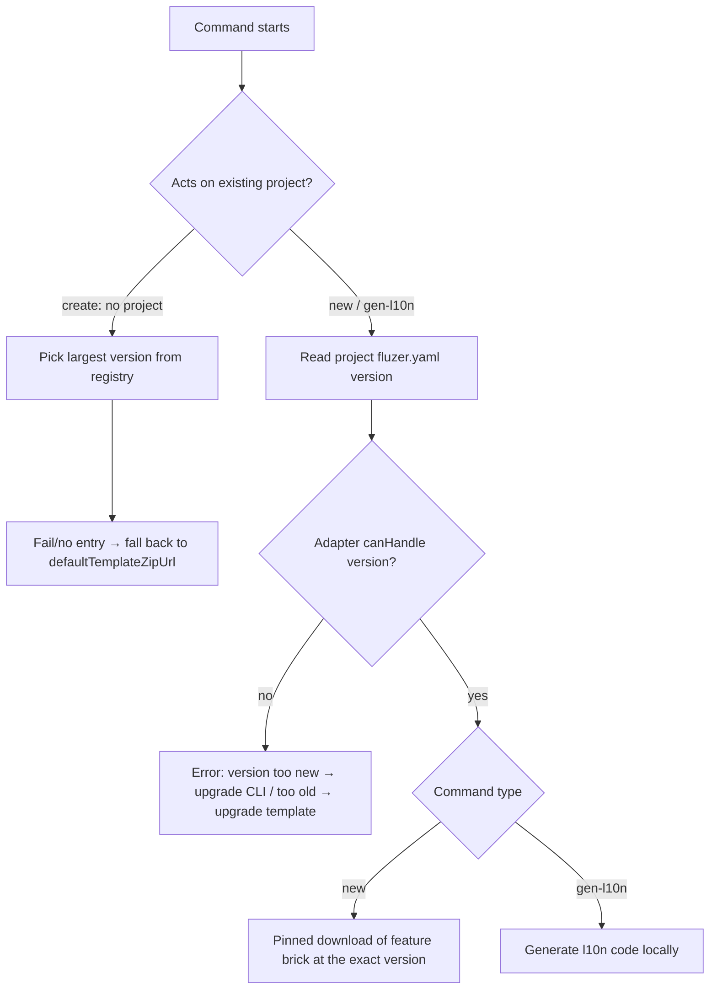

# Version Constraint Rules

This page unifies the version relationship among the three entities in `flutter_zero` —
**Project / CLI (fluzer) / Template** — and how each of the three commands
`create` / `new` / `gen-l10n` decides "which template to use, and whether it can run".

> Context: the template and the CLI are decoupled and released independently (see [Release Process](release.md)).
> A project records the "template version it was born from" at creation time. The three versions may diverge,
> but since 2.0.0 the `minCliVersion` gate has been **removed** — the CLI aims to support all template versions,
> and only errors when a project's `version` falls outside a command's "version adapter" range.

---

## Three Independently Released Version Entities

| Entity | Source | Meaning |
|--------|--------|---------|
| **CLI version `cliVersion`** | `pubspec.yaml` / `template_config.dart` constant in `flutter_zero_cli` | The running `fluzer` binary version, e.g. `1.2.0` |
| **Template version** | `version` of each entry in the template registry `template_registry.json` | A published template snapshot; `create` picks the latest, `new` pins it exactly |
| **Project template version** | `version` in the project-root `fluzer.yaml` (compatible with `flutter_zero_config.yaml`) | Which template version this project was created from (e.g. `1.0.1`) |

The three are released independently and never block each other.

Terms used below:

- **"Project template version"** = the `version` field value in the project's `fluzer.yaml` (the template version this project was born from).
- **"Template registry"** = the published `template_registry.json` (`templates` list, each with `version` + `url`).
- **"Version adapter"** = the object each command uses to pick its execution logic by the project `version` (`new` → `NewV1V2Adapter`, `gen-l10n` → `GenL10nV1V2Adapter`).

> ⚠️ The `minCliVersion` field has been **removed**: any `minCliVersion` left in `template_registry.json` is historical metadata the CLI no longer reads, and `fluzer.yaml` no longer contains `minCliVersion`. The `minCliVersion`-gate logic in old docs/projects is obsolete.

---

## How a command decides "which template, can it run"

### create (no project, CLI-driven, always the latest template)

`create` builds a project from scratch and never touches any `fluzer.yaml`. Template selection is driven entirely by the CLI:

- Among all template-registry entries, pick the one with the **largest `version`** to download (always the latest template).
- Registry fetch failed / no entry → **silently fall back** to the built-in `defaultTemplateZipUrl`, no error.

> `create` never refuses — it can always pull a usable template.

### new / gen-l10n (existing project, run via version adapters)

`new` / `gen-l10n` act on an existing project and are unified by `AdapterCommand` as "read project `version` → walk the adapter chain to pick a claimant → delegate execution":

1. `ProjectConfig.load()` validates structure (`version` non-empty and `>= 1.0.0` lower bound + `template_name`).
2. Walk this command's adapter chain (`adapters`), calling `canHandle(version)` on each, taking the first claimant.
3. Hit → delegate the whole command to that adapter.
4. No hit (current CLI can't handle this template version) → branch on `version >= maxSupportedVersion`:
   - **Too new**: prompt "please upgrade fluzer";
   - **Too old**: prompt "please upgrade the template/CLI";
   and return exit code 1.

The env vars `FLUZER_BRICKS_DIR` / `FLUZER_TEMPLATE_ZIP_URL` only override the download source; they don't affect adapter selection.

> The `new` adapter pins the download to the exact same template `version` (`selectExact`); `gen-l10n` downloads no template — it only parses `l10n.yaml` / `AppLocalizations` locally and generates code.

---

## Flow Diagram

---

## Boundary Scenarios

| Project template version (config.version) | Current CLI adapter range | Result |
|-------------------------------------------|---------------------------|--------|
| `1.0.1` | `[1.0.0, ∞)` (`NewV1V2Adapter` / `GenL10nV1V2Adapter`) | Pass; `new` downloads `1.0.1` template exactly |
| `2.0.0` | `[1.0.0, ∞)` | Pass; `new` downloads `2.0.0` template exactly |
| `0.9.0` (below the `1.0.0` floor) | Not supported | `new`/`gen-l10n`: error "version too old, upgrade template/CLI" |
| `9.9.9` (far beyond known versions) | Current adapters are unbounded, still claim | Pass (if a future adapter sets an upper bound, it would prompt "upgrade fluzer") |
| Legacy project (only the old name `flutter_zero_config.yaml`) | Still recognized | Pass; config name is backward compatible |

---

## Maintenance Constraint (adapters sync with template versions)

When a template release introduces **behavioral differences** (e.g. `new`'s DI injection anchor, or directory structure that varies by template version),
add/adjust the corresponding **version adapter** instead of relying on a `minCliVersion` gate:

- If a new template version breaks `new`/`gen-l10n` execution flow, add an adapter covering that version (e.g. `NewV2Adapter`) and register it in the command's `adapters` chain.
- A command's `maxSupportedVersion` is derived from each adapter's `RangeSpec.upper`, serving as the single source of truth for the "capability ceiling".
- `template_registry.json` only needs `version` + `url` (`create` picks the largest, `new` matches exactly); the `minCliVersion` field is no longer required.

---

## Related Documents

- CLI version spec: see [CLI Versioning](versioning-cli.md).
- Template version spec: see [Template Versioning](versioning-template.md).
- Release & decoupling process: see [Release Process](release.md).

<!-- source-footer -->

---

*Source of this page: [docs/en/versioning-rules.md](https://github.com/Dboy233/flutter_zero_doc/blob/main/docs/en/versioning-rules.md)*

*[Report an error on this page](https://github.com/Dboy233/flutter_zero_doc/issues/new?template=doc_bug_en.md&title=%5BDocs%20error%5D%20docs%2Fen%2Fversioning-rules.md)*
