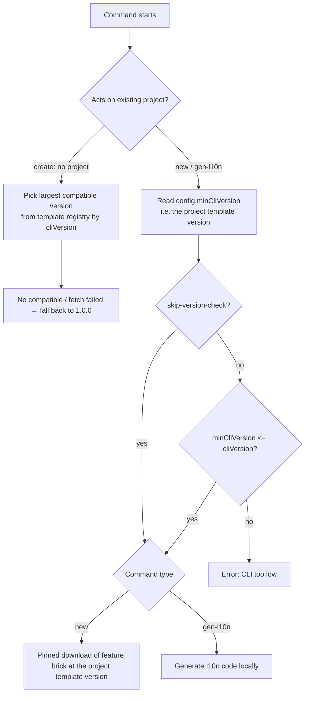

# Version Constraint Rules

This page unifies the version-constraint relationship among the three entities in `flutter_zero` —
**Project / CLI (fluzer) / Template** — and the version-gating logic of the three commands
`create` / `new` / `gen-l10n`.

> Context: the template and the CLI are decoupled and released independently (see [Release Process](release.md)).
> A project records the "template version it was born from" at creation time. The three versions may diverge,
> so version constraints are required to keep commands safe and avoid generating broken code with an incompatible CLI.

---

## Three Independently Released Version Entities

| Entity | Source | Meaning |
|--------|--------|---------|
| **CLI version `cliVersion`** | `pubspec.yaml` / `template_config.dart` constant in `flutter_zero_cli` | The running `fluzer` binary version, e.g. `1.2.0` |
| **Template version** | `version` + `minCliVersion` of each entry in the template registry `template_registry.json` | A published template snapshot, and the "minimum CLI version that can use it" |
| **Project template version** | `version` + `minCliVersion` in the project-root `flutter_zero_config.yaml` | Which template version this project was created from (e.g. `1.0.1`) |

The three are released independently and never block each other — which is exactly why version constraints are needed.

Terms used below:

- **"Project template version"** = the `version` field value in the project's `flutter_zero_config.yaml` (the template version this project was born from).
- **"Template registry"** = the published `template_registry.json`, which lists every available template version and its `minCliVersion`.
- **`minCliVersion`** = the minimum CLI version a template version requires; it is written both in the matching `template_registry.json` entry and in the project's `flutter_zero_config.yaml`.

---

## Two Version "Sources of Truth"

| Source of truth | Commands affected | Note |
|-----------------|-------------------|------|
| Template registry `template_registry.json` | `create` | When creating a new project there is no project and no config, so the CLI must pick the template from the registry |
| Project `flutter_zero_config.yaml` | `new` / `gen-l10n` | The project already exists, so its "birth template version" must be respected for reproducibility |

---

## Unified Gate Formula (commands acting on existing projects)

Any command that **acts on an existing project** (`new` / `gen-l10n`) enforces one compatibility gate before running:

```text
minCliVersion in the project's flutter_zero_config.yaml <= the running CLI version cliVersion   →  pass, run the command
otherwise                                                                                      →  error, refuse to run
```

`minCliVersion` is read straight from the project's `flutter_zero_config.yaml` (**offline; the template registry is never queried**).

The only failure mode:

- `config.minCliVersion > current CLI version` → "CLI version too low; the project template version requires CLI >= minCliVersion, please upgrade fluzer".

> The `minCliVersion` used by the gate is read directly from the **project `flutter_zero_config.yaml`** (offline),
> so the gate is stable and does not depend on fetching the template registry; `gen-l10n` stays fully offline.
> Old projects that lack this field default to `0.0.0` (compatible with any CLI).
> The `version >= 1.0.0` lower-bound check is still kept as the first line of defense.

---

## Per-Command Version Constraints

### create (no project, CLI-driven)

`create` builds a project from scratch and never touches any `flutter_zero_config.yaml`. Template selection is driven entirely by the CLI version:

- Among all template-registry entries with `minCliVersion <= cliVersion`, pick the one with the **largest `version`** to download.
- No compatible entry / registry fetch failed → **silently fall back** to the built-in `defaultTemplateZipUrl` (fixed `1.0.0`), no error.

> Design difference: `create` is "CLI picks a usable template and never refuses"; `new`/`gen-l10n` are
> "project pins the version, and refuse if the CLI can't support it" — opposite directions with different failure strategies.

### new (existing project, pinned download by project template version)

Flow:

1. `ProjectConfig.load()` validates structure (including the `version >= 1.0.0` lower bound).
2. **Compatibility gate**: error if `config.minCliVersion <= cliVersion` is false.
3. **Pinned download by project template version**: fetch the exact-version entry's `url` from the template registry to build a `RemoteBrickLoader`, and use its `feature` brick to generate the module.

The env vars `FLUZER_BRICKS_DIR` / `FLUZER_TEMPLATE_ZIP_URL` only override the download source; **the gate still runs**.

### gen-l10n (existing project, gate only, no download)

Uses the **same gate** as `new`: read `config.minCliVersion` → check `minCliVersion <= cliVersion` (**offline; the template registry is never queried**).

**But `gen-l10n` downloads no template** — it only parses `l10n.yaml` / `AppLocalizations` locally and generates code.
Pass the gate → run locally; fail → error.

### --skip-version-check

For debugging, `--skip-version-check` skips the gate (the env-var download override should still be used with the real version).

---

## Flow Diagram



---

## Boundary Scenarios

| Project template version (config.version) | Min CLI version | Current CLI | Result |
|-------------------------------------------|-----------------|-------------|--------|
| `1.0.0` | `1.0.0` | `1.1.0` | Pass; `new` downloads `1.0.0` template |
| `1.0.1` | `1.1.0` | `1.1.0` | Pass; `new` downloads `1.0.1` template |
| `1.0.1` | `1.1.0` | `1.0.0` | Error "CLI too low" |
| `9.9.9` (no such registry entry) | — | any | `new`: error "unknown template version"; `gen-l10n`: pass (no download — the gate only reads `minCliVersion`, absent means `0.0.0`) |
| Old project (no `minCliVersion` → `0.0.0`) | `0.0.0` | `1.1.0` | Pass; gate `0.0.0 <= 1.1.0` always compatible |

---

## Maintenance Constraint (two places must stay in sync)

The `minCliVersion` in a project's `flutter_zero_config.yaml` and the `minCliVersion` of the
corresponding version in the template registry `template_registry.json` **must share the same value**:

- When releasing a template, the brick carries the correct `minCliVersion` into new projects.
- The template-registry entry for that same version keeps the same `minCliVersion`.
- A mismatch causes the gate to misjudge. See [Release Process](release.md).

---

## Related Documents

- CLI version spec: see [CLI Versioning](versioning-cli.md).
- Template version spec: see [Template Versioning](versioning-template.md).
- Release & decoupling process: see [Release Process](release.md).

<!-- source-footer -->

---

*Source of this page: [docs/en/versioning-rules.md](https://github.com/Dboy233/flutter_zero_doc/blob/main/docs/en/versioning-rules.md)*

*[Report an error on this page](https://github.com/Dboy233/flutter_zero_doc/issues/new?template=doc_bug_en.md&title=%5BDocs%20error%5D%20docs%2Fen%2Fversioning-rules.md)*
