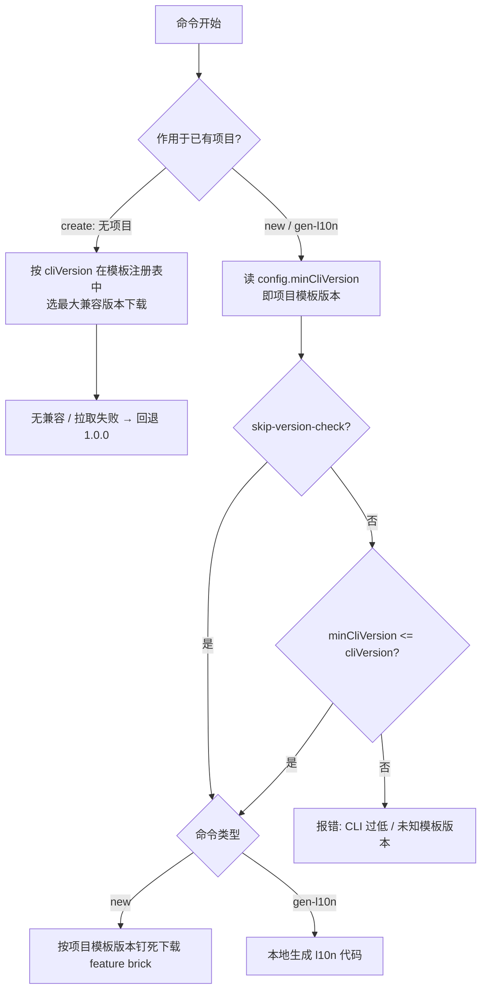

# 版本约束规则 / Version Constraint Rules

本文统一阐述 `flutter_zero` 体系中 **项目（Project）/ CLI（fluzer）/ 模板（Template）**
三者之间的版本约束关系，以及 `create` / `new` / `gen-l10n` 三条命令各自的版本门禁逻辑。

> 背景：模板与 CLI 解耦、独立发版（见 [发布流程](release.md)），项目在创建时记录"出生模板版本"。
> 三者版本可能不一致，必须靠版本约束保证命令安全执行、避免用不兼容的 CLI 生成坏代码。

---

## 三个独立发版的版本实体

| 实体 | 来源 | 含义 |
|------|------|------|
| **CLI 版本 `cliVersion`** | `flutter_zero_cli` 的 `pubspec.yaml` / `template_config.dart` 常量 | 当前运行的 fluzer 二进制版本，如 `1.2.0` |
| **模板版本** | 模板注册表 `template_registry.json` 每条目的 `version` + `minCliVersion` | 一个发布的模板快照，及"能使用它的最低 CLI 版本" |
| **项目模板版本** | 项目根 `flutter_zero_config.yaml` 的 `version` + `minCliVersion` | 该项目是由哪个模板版本创建的（如 `1.0.1`） |

三者各自发版、互不打扰——这正是需要版本约束的根因。

下文统一称：

- **「项目模板版本」** = 项目 `flutter_zero_config.yaml` 里的 `version` 字段值（该项目"出生"时用的模板版本）。
- **「模板注册表」** = 仓库发布的 `template_registry.json`，列出所有可用模板版本及其 `minCliVersion`。
- **`minCliVersion`** = 某个模板版本要求的最低 CLI 版本；它同时写在 `template_registry.json` 对应条目和项目 `flutter_zero_config.yaml` 中。

---

## 两个版本"真相源"

| 真相源 | 影响的命令 | 说明 |
|--------|------------|------|
| 模板注册表 `template_registry.json` | `create` | 创建新项目时无项目、无 config，只能由 CLI 按模板注册表选模板 |
| 项目 `flutter_zero_config.yaml` | `new` / `gen-l10n` | 项目已存在，必须尊重其"出生时的模板版本"，保证可复现 |

---

## 统一门禁公式（作用于已有项目的命令）

`new` / `gen-l10n` 都对已有项目执行，运行前统一做一道兼容门禁：

```text
项目 flutter_zero_config.yaml 中的 minCliVersion <= 当前运行的 CLI 版本 cliVersion   →  通过，执行命令
否则                                                                    →  报错，拒绝执行
```

其中 `minCliVersion` 直接取自项目 `flutter_zero_config.yaml`（**离线读取，不查模板注册表**）。

唯一失败原因：

- `config.minCliVersion > 当前 CLI 版本` → 报"当前 CLI 版本过低，项目模板版本需要 CLI >= minCliVersion，请升级 fluzer"。

> 门禁依据的 `minCliVersion` 直接取自**项目 `flutter_zero_config.yaml`**（离线读取），
> 不依赖联网拉取模板注册表，因此门禁稳定，且 `gen-l10n` 可保持离线执行。
> 老项目若缺失该字段，默认按 `0.0.0` 处理（恒兼容任意 CLI）。
> 原有的 `version >= 1.0.0` 下限校验仍保留为第一道防线。

---

## 各命令的版本约束

### create（无项目，CLI 驱动）

`create` 从零创建项目，不涉及任何 `flutter_zero_config.yaml`。模板选择完全由 CLI 版本决定：

- 在模板注册表中取所有 `minCliVersion <= cliVersion` 的条目，选其中 **`version` 最大** 者下载。
- 无兼容条目 / 注册表拉取失败 → **静默回退**内置 `defaultTemplateZipUrl`（固定 `1.0.0`），不报错。

> 设计差异：`create` 是"CLI 挑可用模板且永不拒绝"；`new`/`gen-l10n` 是"按项目模板版本钉死、CLI 撑不住就报错"——
> 两者方向相反、容错策略不同。

### new（已有项目，按项目模板版本钉死下载）

流程：

1. `ProjectConfig.load()` 校验结构（含 `version >= 1.0.0` 下限）。
2. **兼容门禁**：`config.minCliVersion <= cliVersion` 不成立则报错。
3. **按「项目模板版本」钉死下载**：从模板注册表取该精确版本条目的 `url` 构造 `RemoteBrickLoader`，用其 `feature` brick 生成模块。

环境变量 `FLUZER_BRICKS_DIR` / `FLUZER_TEMPLATE_ZIP_URL` 仅覆盖下载来源，**门禁仍执行**。

### gen-l10n（已有项目，仅门禁，不下载）

与 `new` 走**同一道门禁**：读 `config.minCliVersion` → 判定 `minCliVersion <= cliVersion`（**离线，不查模板注册表**）。

**但 `gen-l10n` 不下载任何模板**——它只在本地解析 `l10n.yaml` / `AppLocalizations` 并生成代码。
门禁通过即本地执行，不通过则报错。

### --skip-version-check

调试时可用 `--skip-version-check` 跳过门禁（环境变量覆盖下载源仍建议配合真实版本使用）。

---

## 流程示意



---

## 边界场景验证

| 项目模板版本（config.version） | 最低 CLI 版本 | 当前 CLI | 结果 |
|-------------------------------|--------------|----------|------|
| `1.0.0` | `1.0.0` | `1.1.0` | 通过；`new` 下载 `1.0.0` 模板 |
| `1.0.1` | `1.1.0` | `1.1.0` | 通过；`new` 下载 `1.0.1` 模板 |
| `1.0.1` | `1.1.0` | `1.0.0` | 报错"CLI 过低" |
| `9.9.9`（注册表无此条目） | — | 任意 | `new`：报错"未知模板版本"；`gen-l10n`：通过（不下载，门禁只看 `minCliVersion`，缺失按 `0.0.0`） |
| 老项目（无 `minCliVersion` → `0.0.0`） | `0.0.0` | `1.1.0` | 通过；门禁 `0.0.0 <= 1.1.0` 恒兼容 |

---

## 维护约束（两处必须同步）

项目 `flutter_zero_config.yaml` 的 `minCliVersion` 与模板注册表 `template_registry.json` 对应版本的 `minCliVersion`
**必须同源同值**：

- 模板发版时，brick 自带正确的 `minCliVersion` 写入新项目；
- 模板注册表同一版本的 `minCliVersion` 与之保持一致；
- 二者不一致会导致门禁误判。发布流程见 [发布流程](release.md)。

---

## 相关文档

- CLI 版本规范见 [CLI 版本管理](versioning-cli.md)。
- 模板版本规范见 [模板版本管理](versioning-template.md)。
- 发布与解耦流程见 [发布流程](release.md)。

<!-- source-footer -->

---

*本页原文：[docs/zh/versioning-rules.md](https://github.com/Dboy233/flutter_zero_doc/blob/main/docs/zh/versioning-rules.md)*

*[报告本页错误](https://github.com/Dboy233/flutter_zero_doc/issues/new?template=doc_bug_zh.md&title=%E3%80%90%E6%96%87%E6%A1%A3%E9%94%99%E8%AF%AF%E3%80%91docs%2Fzh%2Fversioning-rules.md)*
