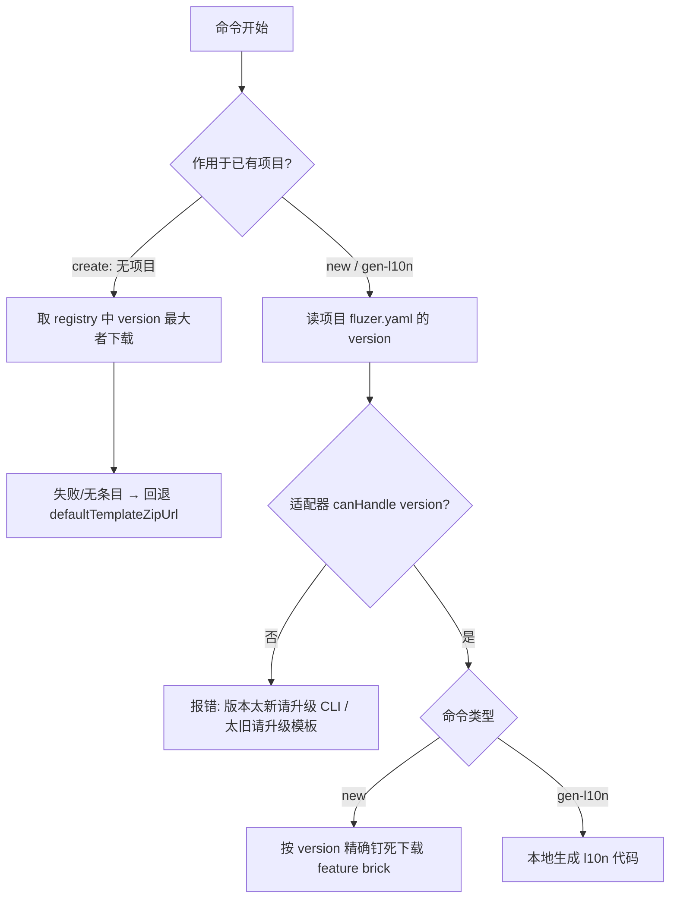

# 版本约束规则 / Version Constraint Rules

本文统一阐述 `flutter_zero` 体系中 **项目（Project）/ CLI（fluzer）/ 模板（Template）**
三者之间的版本关系，以及 `create` / `new` / `gen-l10n` 三条命令各自如何决定「用哪个模板、能否执行」。

> 背景：模板与 CLI 解耦、独立发版（见 [发布流程](release.md)），项目在创建时记录"出生模板版本"。
> 三者版本可能不一致，但 2.0.0 起已**移除 `minCliVersion` 版本门禁**——CLI 力求适配所有模板版本，
> 仅当项目 `version` 超出命令「版本适配器」的支持范围时才报错。

---

## 三个独立发版的版本实体

| 实体 | 来源 | 含义 |
|------|------|------|
| **CLI 版本 `cliVersion`** | `flutter_zero_cli` 的 `pubspec.yaml` / `template_config.dart` 常量 | 当前运行的 fluzer 二进制版本，如 `1.2.0` |
| **模板版本** | 模板注册表 `template_registry.json` 每条目的 `version` | 一个发布的模板快照，`create` 据此选最新、`new` 据此精确钉死 |
| **项目模板版本** | 项目根 `fluzer.yaml`（兼容 `flutter_zero_config.yaml`）的 `version` | 该项目是由哪个模板版本创建的（如 `1.0.1`） |

三者各自发版、互不打扰。

下文统一称：

- **「项目模板版本」** = 项目 `fluzer.yaml` 里的 `version` 字段值（该项目"出生"时用的模板版本）。
- **「模板注册表」** = 仓库发布的 `template_registry.json`（`templates` 列表，每条含 `version` + `url`）。
- **「版本适配器」** = 命令内部按项目 `version` 选择执行逻辑的对象（`new` → `NewV1V2Adapter`，`gen-l10n` → `GenL10nV1V2Adapter`）。

> ⚠️ `minCliVersion` 字段已**移除**：`template_registry.json` 中残留的 `minCliVersion` 仅为历史元数据，CLI 不再读取；
> 配置文件 `fluzer.yaml` 中也不再含 `minCliVersion`。旧文档/旧项目里的 `minCliVersion` 门禁逻辑均已失效。

---

## 命令如何决定「用哪个模板、能否执行」

### create（无项目，CLI 驱动，始终用最新模板）

`create` 从零创建项目，不涉及任何 `fluzer.yaml`。模板选择完全由 CLI 决定：

- 在模板注册表中取 `version` **最大**者下载（始终最新模板）。
- 注册表拉取失败 / 无条目 → **静默回退**内置 `defaultTemplateZipUrl`，不报错。

> `create` 永不拒绝——总能拉到一个可用模板。

### new / gen-l10n（已有项目，按版本适配器执行）

`new` / `gen-l10n` 作用于已有项目，由 `AdapterCommand` 统一「读项目 `version` → 沿适配器链选认领者 → 委托执行」：

1. `ProjectConfig.load()` 校验结构（`version` 非空且 `>= 1.0.0` 下限 + `template_name`）。
2. 沿本命令的适配器链（`adapters`）逐个 `canHandle(version)`，取第一个认领者。
3. 命中 → 委托该适配器执行整条命令。
4. 全不命中（当前 CLI 不支持该模板版本）→ 按 `version >= maxSupportedVersion` 分支打印：
   - **太新**：提示「请升级 fluzer」；
   - **太旧**：提示「请升级模板/CLI」；
   并返回退出码 1。

环境变量 `FLUZER_BRICKS_DIR` / `FLUZER_TEMPLATE_ZIP_URL` 仅覆盖下载来源，不影响适配器选择。

> `new` 的适配器会按项目 `version` **精确钉死**下载同名模板（`selectExact`）；`gen-l10n` 不下载任何模板，只在本地解析 `l10n.yaml` / `AppLocalizations` 并生成代码。

---

## 流程示意

---

## 边界场景

| 项目模板版本（config.version） | 当前 CLI 适配器支持范围 | 结果 |
|-------------------------------|--------------------------|------|
| `1.0.1` | `[1.0.0, ∞)`（`NewV1V2Adapter` / `GenL10nV1V2Adapter`） | 通过；`new` 精确下载 `1.0.1` 模板 |
| `2.0.0` | `[1.0.0, ∞)` | 通过；`new` 精确下载 `2.0.0` 模板 |
| `0.9.0`（低于下限 `1.0.0`） | 不支持 | `new`/`gen-l10n`：报错「版本太旧，请升级模板/CLI」 |
| `9.9.9`（远超已知版本） | 当前适配器无上界，仍认领 | 通过（若未来适配器设置上界，则提示「请升级 fluzer」） |
| 老项目（只有旧名 `flutter_zero_config.yaml`） | 仍识别 | 通过；配置名向下兼容 |

---

## 维护约束（适配器与模板版本同步）

当模板发版引入**行为差异**时（例如 `new` 的 DI 注入锚点、目录结构随模板版本变化），
需要为其增加/调整对应的**版本适配器**，而非依赖 `minCliVersion` 门禁：

- 若新模板版本对 `new`/`gen-l10n` 的执行流程有破坏性差异，新增一个覆盖该版本的适配器（如 `NewV2Adapter`），并注册到命令的 `adapters` 链。
- 命令的 `maxSupportedVersion` 由各适配器 `RangeSpec.upper` 推导，作为「能力上界」单一事实源。
- `template_registry.json` 只需维护 `version` + `url`（`create` 取最大、`new` 精确匹配），不再需要 `minCliVersion` 字段。

---

## 相关文档

- CLI 版本规范见 [CLI 版本管理](versioning-cli.md)。
- 模板版本规范见 [模板版本管理](versioning-template.md)。
- 发布与解耦流程见 [发布流程](release.md)。

<!-- source-footer -->

---

*本页原文：[docs/zh/versioning-rules.md](https://github.com/Dboy233/flutter_zero_doc/blob/main/docs/zh/versioning-rules.md)*

*[报告本页错误](https://github.com/Dboy233/flutter_zero_doc/issues/new?template=doc_bug_zh.md&title=%E3%80%90%E6%96%87%E6%A1%A3%E9%94%99%E8%AF%AF%E3%80%91docs%2Fzh%2Fversioning-rules.md)*
